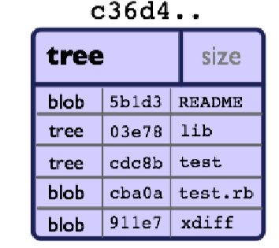

# Git命令学习

### Git对象模型

所有表示项目历史信息的文件都会通过用sha1哈希计算得来的40字符表示，对象的内容不同，哈希值也不同，亦通过哈希验证内容是否正确

### 对象

每个对象都有三个部分：类型、大小、内容，类型有："blob"、"tree"、 "commit" 和"tag"

git会把每次提交的文件内容都给记录下来

Blob对象：用来存储文件的内容，一个"blob对象"就是一块二进制数据，它没有指向任何东西或有任何其它属性，甚至连文件名都没有。因为blob对象内容全部都是数据，如两个文件在一个目录树（或是一个版本仓库）中有同样的数据内容，那么它们将会共享同一个blob对象。Blob对象和其所对应的文件所在路径、文件名是否改被更改都完全没有关系。

Tree 对象：一个tree对象有一串(bunch)指向blob对象或是其它tree对象的指针，它一般用来来表示内容之间的目录层次关系。

git show命令还可以用来查看tree对象，但是git ls-tree能让你看到更多的细节。如果我们有一个tree对象的 SHA1哈希值，我们可以像下面一样来查看它：

一个tree对象包括一串(list)条目，每一个条目包括：mode、对象类型、SHA1值 和名字(这串条 目是按名字排序的)。它用来表示一个目录树的内容。 一个tree对象可以指向(reference): 一个包含文件内容的blob对象, 也可以是其它包含某个子目录内容的其它tree 对象. Tree对象、blob对象和其它所有的对象一样，都用其内容的SHA1哈希值来命名的；只有当两个tree对象的内容完全相同（包括其所指向所有子对象）时，它的名字才会一样，反之亦然。这样就能让Git仅仅通过比较两个相关的tree对象的名字是否相同，来快速的判断其内容是否不同。 

Commit对象"commit对象"指向一个"tree对象", 并且带有相关的描述信息

可以用 --pretty=raw 参数来配合 git show 或 git log 去查看某个提交(commit):

 一个提交(commit)由以下的部分组成: 

注意: 一个提交(commit)本身并没有包括任何信息来说明其做了哪些修改; 所有的修改(changes)都是通过与父提交(parents)的内容比较而得出的. 值得一提的是, 尽管git可以检测到文件内容不变而路径改变的情况, 但是它不会 去显式(explicitly)的记录文件的更名操作.一般用 git commit 来创建一个提交(commit), 这个提交(commit)的父对象一般是当前分支(current HEAD),　 同时把存储在当前索引(index)的内容全部提交.

### 对象模型

如果我们把它提交(commit)到一个Git仓库中, 在Git中它们也许看起来就如下图:

每个目录都创建了 tree对象  (包括根目录), 每个文件都创建了一个对应的 blob对象  . 最后有一个 commit对象 来指向根tree对象(root of trees), 这样我们就可以追踪项目每一项提交内容.

### 标签对象

一个标签对象包括一个对象名(SHA1签名), 对象类型, 标签名, 标签创建人的名字("tagger"), 还有一 条可能包含有签名(signature)的消息. 你可以用 git cat-file 命令来查看这些信息:

### GIT目录  与  工作目录

'Git目录'是为你的项目存储所有历史和元信息的目录，包括所有的对象, 这些对象指向不同的分支，每一个项目只能有一个'Git目录'，这个叫'.git'的目录在你项目 的根目录下(这是默认设置,但并不是必须的). 如果你查看这个目录的内容, 你可以看所有的重要文件:

工作目录 Git的 '工作目录' 存储着你现在签出(checkout)来用来编辑的文件. 当你在项目的不同分支间切换时, 工作目录里 的文件经常会被替换和删除. 所有历史信息都保存在 'Git目录'中 ;　工作目录只用来临时保存签出(checkout) 文 件的地方, 你可以编辑工作目录的文件直到下次提交(commit)为止. 

### 查看索引 

使用 git status 命令是查看索引内容的最简单办法. 你运行 git status命令, 就可以看到: 哪些文件被暂存了(就是 在你的Git索引中), 哪些文件被修改了但是没有暂存, 还有哪些文件没有被跟踪。

