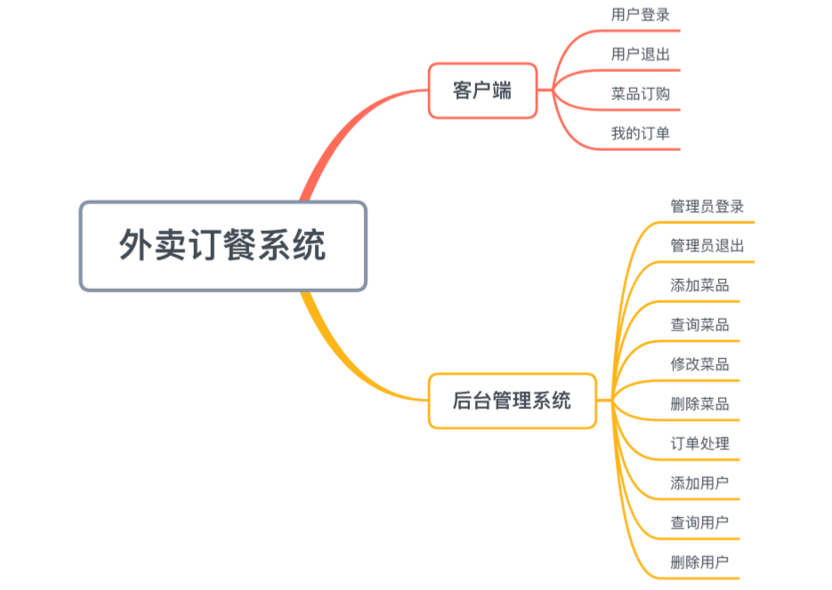
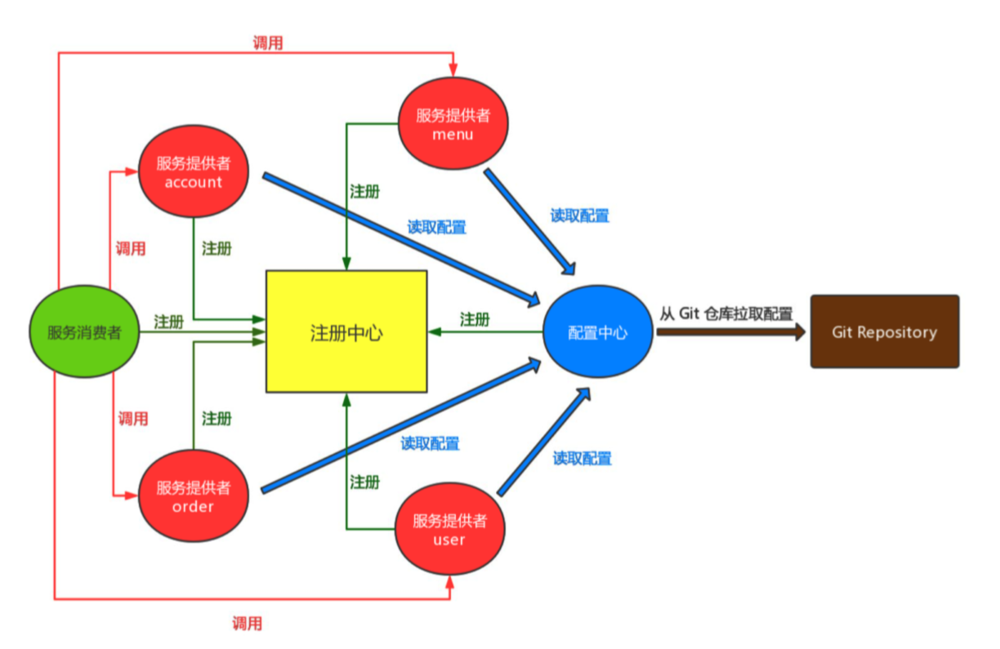

# 基于Spring Cloud的外卖订餐系统

## 项目需求：

### 分为客户端与后台管理系统：

客户端：普通用户：用户登录、退出、菜品订购、我的订单。

后台管理系统：管理员：登录、退出、添加菜品、查询菜品、修改菜品、删除菜品、订单处理、添加用户、查询用户、删除用户。



微服务把项目进行拆分：分成四个服务提供者：

Account 提供账户服务：用户与管理的登录退出；

Menu 提供菜品服务：添加、删除、修改、查询菜品；

Order 提供订单服务：添加、删除、查询、处理订单；

User 提供用户服务：添加、删除、查询 用户；

分离出一个服务消费者，调用以上四个服务提供者，服务消费者包含了客户端的前端页面和后台接口、后台管理系统的前端页面和后台接口。用户 / 管理员直接访问的资源都保存在服务消费者中，服务消费者根据具体的需求调用四个服务提供者的业务逻辑，通过 Feign 实现负载均衡。

四个服务提供者和一个服务消费者都需要在注册中心进行注册，同时使用配置中心来对配置文件进行统一集中管理。



## 环境搭建：

##### 创建父工程	SpringCloud_WM

pom.xml：	(若为 jdk 9 以上版本则需要添加jaxb-api，jdk 8则不需要添加)

```xml
<parent>
    <groupId>org.springframework.boot</groupId>
    <artifactId>spring-boot-starter-parent</artifactId>
    <version>2.0.7.RELEASE</version>
</parent>

<dependencies>
    <dependency>
        <groupId>org.springframework.boot</groupId>
        <artifactId>spring-boot-starter-web</artifactId>
    </dependency>
    <!-- JDK 9 缺失jar -->
    <dependency>
        <groupId>javax.xml.bind</groupId>
        <artifactId>jaxb-api</artifactId>
        <version>2.3.0</version>
    </dependency>

    <dependency>
        <groupId>com.sun.xml.bind</groupId>
        <artifactId>jaxb-impl</artifactId>
        <version>2.3.0</version>
    </dependency>

    <dependency>
        <groupId>com.sun.xml.bind</groupId>
        <artifactId>jaxb-core</artifactId>
        <version>2.3.0</version>
    </dependency>

    <dependency>
        <groupId>javax.activation</groupId>
        <artifactId>activation</artifactId>
        <version>1.1.1</version>
    </dependency>

    <dependency>
        <groupId>org.projectlombok</groupId>
        <artifactId>lombok</artifactId>
        <optional>true</optional>
    </dependency>
</dependencies>

<dependencyManagement>
    <dependencies>
        <dependency>
            <groupId>org.springframework.cloud</groupId>
            <artifactId>spring-cloud-dependencies</artifactId>
            <version>Finchley.SR2</version>
            <type>pom</type>
            <scope>import</scope>
        </dependency>
    </dependencies>
</dependencyManagement>
```


##### 创建注册中心：eurekaserver

pom.xml：

```xml
<dependencies>
    <dependency>
        <groupId>org.springframework.cloud</groupId>
        <artifactId>spring-cloud-starter-netflix-eureka-server</artifactId>
        <version>2.0.2.RELEASE</version>
    </dependency>
</dependencies>
```

application.yml：

```yml
server:
  port: 8761
eureka:
  client:
    service-url:
      defaultZone: http://localhost:8761/eureka/
    register-with-eureka: false
    fetch-registry: false
```

启动类：EurekaServerApplication

```java
@SpringBootApplication
@EnableEurekaServer
public class EurekaServerApplication {
    public static void main(String[] args) {
        SpringApplication.run(EurekaServerApplication.class,args);
    }
}
```

##### 配置中心：configserver

pom.xml：

```xml
<dependencies>
  <dependency>
    <groupId>org.springframework.cloud</groupId>
    <artifactId>spring-cloud-config-server</artifactId>
    <version>2.0.2.RELEASE</version>
  </dependency>
</dependencies>
```

application.yml：

```yml
server:
  port: 8762
spring:
  application:
    name: configserver
  profiles:
    active: native
  cloud:
    config:
      server:
        native:
          search-locations: classpath:/shared
```

在 shared 路径下创建各个微服务对应的配置文件：

# 明天再写！