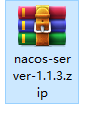
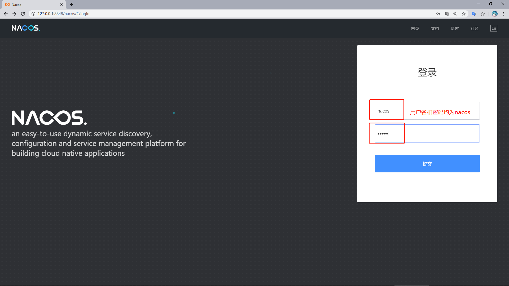
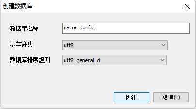

# 微服务闪翼支付

## Nacos安装使用

nacos是阿里的一个服务注册发现中心

下载后解压：



进入bin目录点击start.cmd：输入 localhost:8848/nacos 打开登录页




配置外置数据库Mysql5.7：



SQL配置语句从外部导入： ${nacoshome}/conf/nacosmysql.sql

修改${nacoshome}/conf/application.properties文件，增加支持mysql数据源配置（目前只支持 mysql），添加mysql数据源的url、用户名和密码：

```properties
spring.datasource.platform=mysql
db.num=1 
db.url.0=jdbc:mysql://localhost:3308/nacos_config?characterEncoding=utf8&connectTimeout=1000&socketTimeout=3000&autoReconnect=true 
db.user=root
db.password=123456
```

========================================================================

